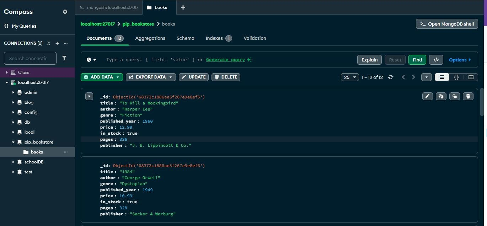

# 📚 PLP Bookstore MongoDB Assignment
# Introduction

Welcome! This repository contains everything you need to practice MongoDB fundamentals using a sample bookstore database.  
You’ll find scripts to insert sample data, perform CRUD and advanced queries, run aggregation pipelines, and test indexing.  
Follow the instructions below to set up the database, run the scripts, and view your data in MongoDB Compass or Atlas.

This project demonstrates the fundamentals of working with MongoDB for the Power Learn Project (PLP) MERN Fullstack course. It includes scripts to populate a sample bookstore database, perform CRUD operations, advanced queries, aggregation pipelines, and indexing.

## Purpose

The purpose of this repository is to help learners understand how to:
- Set up a MongoDB database and collection
- Insert and manage sample data for a bookstore
- Perform basic and advanced queries using the MongoDB shell
- Use aggregation pipelines for data analysis
- Implement indexing for performance optimization

This project is intended for students and developers who want to practice and showcase their MongoDB skills as part of the PLP curriculum.

## Assignment Tasks Covered

This project covers all required tasks:

- **MongoDB Setup:** Scripts automatically create the `plp_bookstore` database and `books` collection.
- **Basic CRUD Operations:** Insert, find, update, and delete operations are included in `queries.js`.
- **Advanced Queries:** Filtering, projection, sorting, and pagination queries are included in `queries.js`.
- **Aggregation Pipelines:** Scripts include pipelines for average price by genre, most prolific author, and grouping by decade.
- **Indexing:** Index creation and performance analysis are included in `queries.js`.
- **Sample Data:** `insert_books.js` provides at least 10 books with all required fields.
- **How to Run:** Step-by-step instructions are provided above.
- **Screenshot:** Please include a screenshot of your `books` collection in MongoDB Compass or Atlas as shown below.

## How to Run

### Prerequisites

- **Node.js** (v18 or higher)
- **MongoDB** (installed locally and running, or use a MongoDB Atlas cluster)
- **MongoDB Shell (mongosh)**

### Steps

1. **Install dependencies** (if any are required):
   ```sh
   npm install
   ```
   *(Note: For this assignment, no extra dependencies are needed if you use only the provided scripts.)*

2. **Start your MongoDB server** (if using local MongoDB):
   ```sh
   mongod
   ```

3. **Insert sample data into your database:**
   ```sh
   node insert_books.js
   ```

4. **Run the MongoDB queries using mongosh:**
   ```sh
   mongosh plp_bookstore --file queries.js
   ```

5. **(Optional) View your data in MongoDB Compass or Atlas:**
   - Open MongoDB Compass or your Atlas dashboard.
   - Connect to your MongoDB instance.
   - Navigate to the `plp_bookstore` database and view the `books` collection.
   

````markdown
## MongoDB Compass Screenshot

Below is a screenshot of my `plp_bookstore` database and `books` collection in MongoDB Compass:

